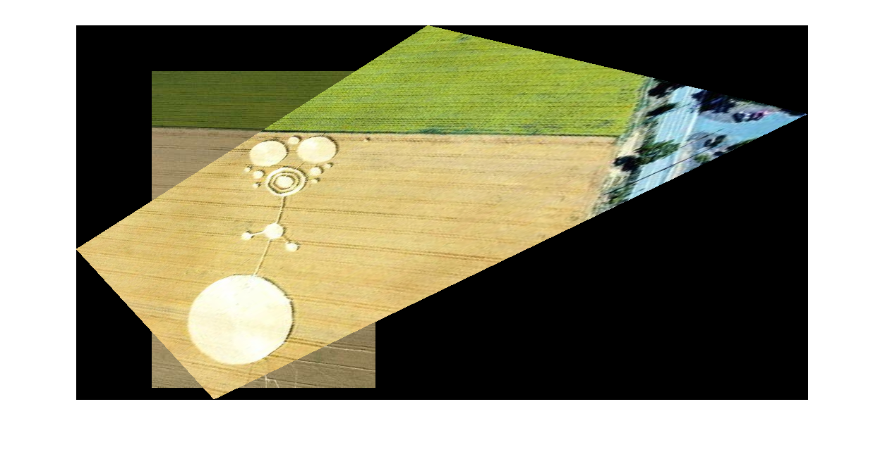
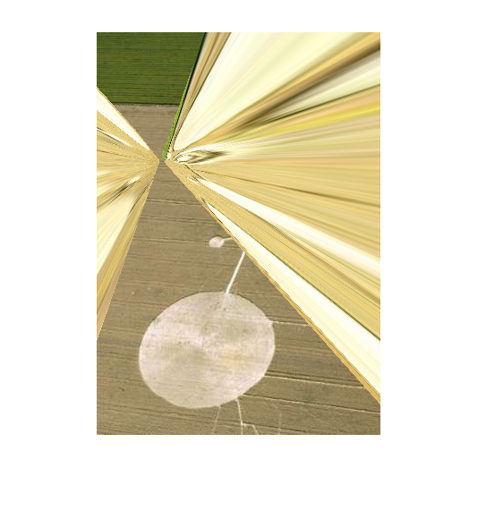

# Image Mosaic Algorithm Implementation

## Description

This is a course project of ECS170 Computer Vision [1] taught by Prof. Yong Jae Lee at UC Davis. In this project, me and [Timothy Zhang](https://github.com/3tz) implemented image mosaic algorithm by applying image warping, homography, and RANSAC techniques [2].

## Testing

In order to reproduce our results, you can run the scripts in src directory,
```
generate_mosaic % shows examples of mosaic
test_ransac     % compares RANSAC and non-RANSAC mosaic
```

## Results

### Input Images

|||
|:---:|:---:|
|Will-be-warped image|Reference image|

### Transforming

|||
|:---:|:---:|
|Warped image|Merged image|

### RANSAC: Random Sample Consensus

|||
|:---:|:---:|
|RANSAC|Non-RANSAC|

## Credits

Special thanks to my project partner, [Timothy Zhang](https://github.com/3tz)

## Reference

- [1] https://www.cs.ucdavis.edu/blog/ecs-174-introduction-to-computer-vision/
- [2] Fischler, Martin A. and Bolles, Robert C., June 1981. Random Sample Consensus: A Paradigm for Model Fitting with Applications to Image Analysis and Automated Cartography. Commun. ACM, p.g. 381–395